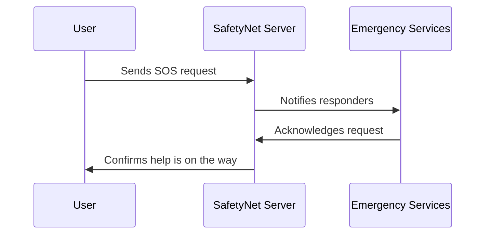

Here's a well-structured and **catchy** `README.md` for your GitHub repository:

---

# 🚨 **SafetyNet - Emergency Response System**

**Real-time emergency alerts & response system for faster rescue operations.**

## 📌 **Overview**
**SafetyNet** is a smart emergency response system that instantly connects users with critical services like **fire, medical, and police**. With just a tap, users can send SOS alerts, share real-time locations, and receive life-saving assistance when every second counts.

### **🔹 Why SafetyNet?**
✔ **Instant SOS Trigger** – Notify emergency services with a single tap.  
✔ **Real-time Location Sharing** – Send GPS coordinates or nearest cell tower data.  
✔ **High-Priority Alerts** – Loud alarms for responders until action is taken.  
✔ **Multi-Category Support** – Fire, accidents, medical emergencies, and more.  
✔ **Triple-Tap SOS** – Trigger emergency alerts even when the phone is locked.

---

## 🚀 **Features**
✅ **Emergency Alert System** – One-click SOS for instant assistance.  
✅ **Live Dashboard for Responders** – Displays emergency requests with details.  
✅ **Multi-Device Support** – Works on **mobile & web platforms**.  
✅ **Custom Emergency Calls** – Users can add personal emergency contacts.


---

## 🎯 **System Architecture**
📌 **User Triggers SOS** → 📌 **Emergency Services Notified** → 📌 **Responders Take Action**



---

## 🔥 **How It Works**
1️⃣ **User sends an SOS alert** with location details.  
2️⃣ **Emergency departments receive high-priority alerts** with continuous notifications.  
3️⃣ **Location is shared in real-time** (GPS or nearest cell tower).  
4️⃣ **Responders take action** and acknowledge the request.  
5️⃣ **System logs all incidents** for analysis and future improvements.

---

## 📥 **Installation & Setup**

### **🔹 Backend Setup**
```bash
git clone https://github.com/your-repo/SafetyNet.git
cd backend
npm install
npm start
```

### **🔹 Frontend Setup**
```bash
cd frontend
npm install
npm start
```

---

## 🏆 **Use Cases**
- **Fire Incidents 🔥** – Immediate alerts to fire departments.
- **Medical Emergencies 🚑** – Quick ambulance dispatch for patients.
- **Road Accidents 🚗** – Notify police and emergency responders instantly.
- **Gas Leaks & Electricity Hazards ⚡** – Early warnings to prevent disasters.

---

## 🛡️ **Security & Privacy**
✔ **End-to-End Encryption** for secure SOS messages.  
✔ **No Unauthorized Access** – Only verified responders receive alerts.  
✔ **User Privacy Protection** – No unnecessary location tracking.

---

## 🤝 **Contributing**
We welcome contributions! Follow these steps:
1. **Fork the repo**
2. **Create a new branch** (`feature-branch`)
3. **Commit your changes**
4. **Push and submit a PR**


---

## ⭐ **Like this project?**
Give it a ⭐ on GitHub and help us improve emergency response systems! 🚀

---
